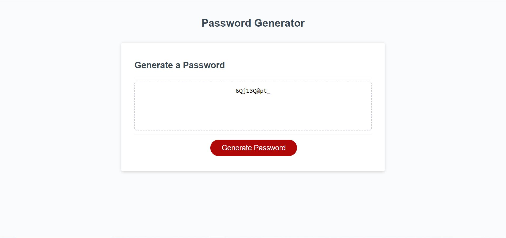

# challenge-3: Password Generator
## Everyone needs passwords, but it's not easy to come up with unique ones. This website allows you to generate a password based on what you may specifically need.

# Usage
## Click the button and answer a couple prompts regarding the length of your password and what characters you need. From there, a password will generate and you may copy it and use it wherever you need!

# License
## MIT License

# Images of Application
## This is the application once you launch the website:

## This is the application once the propmts are answered and a password is generated:
